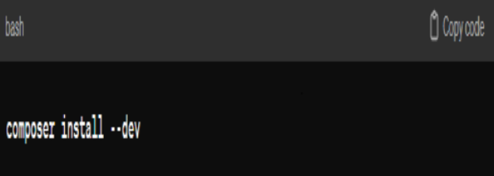

# commande installation dev

<!-- note -->
Lors du développement d'un package avec Composer, il est courant d'avoir des dépendances de développement, telles que des bibliothèques de tests, des outils de documentation, etc. Ces dépendances ne sont généralement pas nécessaires dans un environnement de production, donc elles sont souvent définies comme des dépendances de développement.

<!-- new slide -->