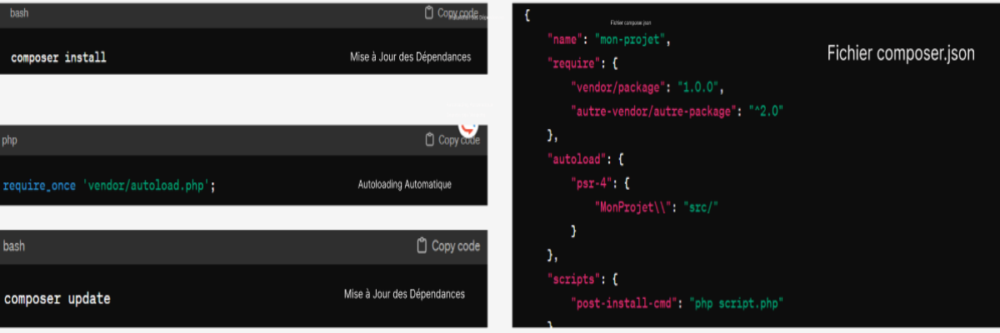
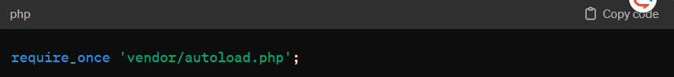
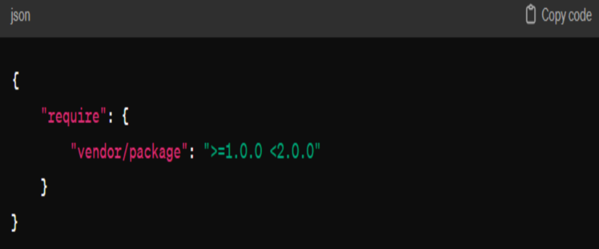

# Composer : Gestionnaire de Dépendances pour PHP imran
## Introduction
{:width="500px"}
*figure: Composer*

Le design thinking est une approche centrée sur l'humain pour résoudre des problèmes complexes et développer des solutions innovantes. Il met l'accent sur l'empathie, la collaboration multidisciplinaire, l'expérimentation et l'itération rapide.
Les étapes de design thinking : 

## Concepts Fondamentaux de Composer
1. Fichier composer.json
{:width="700px"}
*figure: Concepts Fondamentaux de Composer*
Le fichier composer.json est au cœur de Composer. Il contient des informations sur le projet, telles que les dépendances requises, les versions, les scripts personnalisés, et d'autres configurations.
Comprendre les besoins et les perspectives des utilisateurs concernés par le problème à résoudre. Cela implique d'observer, d'écouter et d'interagir avec les utilisateurs pour acquérir une compréhension approfondie de leurs besoins, motivations et défis.
2. Installation des Dépendances
 La commande composer install lit le fichier composer.json et installe les dépendances dans le répertoire vendor.
{:width="500px"}
*figure: Installation des Dépendances*
3. Autoloading Automatique
Composer génère automatiquement un fichier d'autoloading (vendor/autoload.php) qui simplifie l'inclusion des classes dans le code.
{:width="700px"}
*figure: Autoloading Automatique*
4. Mise à Jour des Dépendances
La commande composer update vérifie les dernières versions compatibles des dépendances et met à jour le projet en conséquence.
## Gestion des Versions
{:width="500px"}
*figure: Définir le problème*
Composer utilise le système de gestion sémantique des versions (SemVer) pour garantir la compatibilité entre les différentes versions des bibliothèques. Les versions sont spécifiées dans le fichier composer.json.

## Packagist : Registre de Packages

{:width="500px"}
*figure: Idéation*

Packagist est le principal registre de packages pour Composer. Lorsque vous spécifiez une dépendance, Composer recherche cette dernière sur Packagist pour la télécharger et l'installer.

## Conclusion
{:width="500px"}
*figure: Conclusion*

i fin de ce lab tu doi capable de réaliser vous propre packages avec composer et le publié en pluse de utilisé des pacages via composer 

