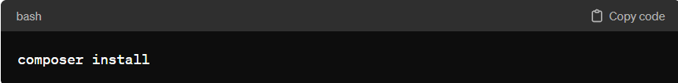

# Composer : Gestionnaire de Dépendances pour PHP

<!-- new slide -->

## Introduction

<!-- new slide -->

# Concepts Fondamentaux de Composer
<!-- new slide -->
## Fichier composer.json

<!-- new slide -->
## Installation des Dépendances

<!-- new slide -->
## Autoloading Automatique

<!-- new slide -->
# Gestion des Versions

<!-- new slide -->
## Packagist : Registre de Packages

<!-- new slide -->
## Conclusion

